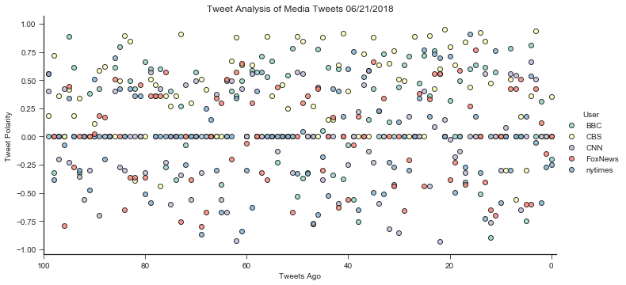
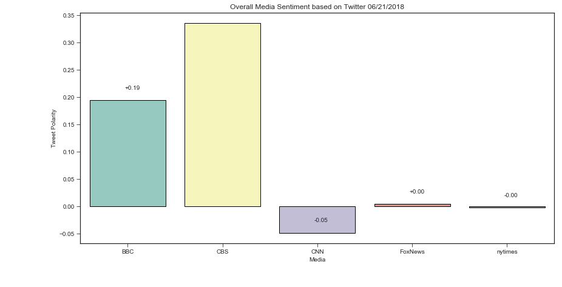

## Media Sentiments

1. BBC and CBS have a more positive sentiment in their tweets
2. FoxNews and NyTimes have a move neutral sentiments their tweets.
3. CNN has a fairly negative sentiments in their tweets.


```python
# Dependencies
import tweepy
import numpy as np
import pandas as pd
import seaborn as sns
from pprint import pprint
from datetime import datetime
import matplotlib.pyplot as plt
import matplotlib.ticker as ticker

# Import and Initialize Sentiment Analyzer
from vaderSentiment.vaderSentiment import SentimentIntensityAnalyzer
analyzer = SentimentIntensityAnalyzer()

# Twitter API Keys
from myKeys import (
    TWITTER_CONSUMER_KEY,
    TWITTER_CONSUMER_SECRET,
    TWITTER_ACCESS_TOKEN,
    TWITTER_TOKEN_SECRET
)

auth = tweepy.OAuthHandler(TWITTER_CONSUMER_KEY, TWITTER_CONSUMER_SECRET)
auth.set_access_token(TWITTER_ACCESS_TOKEN, TWITTER_TOKEN_SECRET)
api = tweepy.API(auth, parser=tweepy.parsers.JSONParser())
```


```python
# Target Search Term
target_terms = ("BBC", "CBS", "CNN","FoxNews", "nytimes")

# List to hold sentiment
sentiment_list = []
sentiments_df = {}

for target in target_terms:

    # Variables for holding sentiments
    compound_list = []
    positive_list = []
    negative_list = []
    neutral_list = []
    count = 0

    # Run search around each tweet
    public_tweets = api.user_timeline(target, count=100)

    # Loop through all tweets
    for tweet in public_tweets:
        #grab user, text, and whatever else is needed

        # Run Vader Analysis on each tweet
        # YOUR CODE HERE
        results = analyzer.polarity_scores(tweet['text'])

        # Create a dictionary of the Average Sentiments
        sentiment = {
            "Count":count,
            "User": target,
            "Text":tweet['text'],
            "Date": datetime.strptime(tweet['created_at'], "%a %b %d %H:%M:%S %z %Y"),
            "Unix": datetime.strptime(tweet['created_at'], "%a %b %d %H:%M:%S %z %Y").strftime("%s"),
            "Compound": results['compound'],
            "Positive": results['pos'],
            "Negative": results['neg'],
            "Neutral": results['neu']
        }
        sentiment_list.append(sentiment)
        count = count + 1

# create the Sentiments
sentiments_df = pd.DataFrame(sentiment_list)
#print(sentiments_df.dtypes)
```


```python
sentiments_df = sentiments_df[['Count','User','Date', 'Unix', 'Text','Compound','Positive','Negative','Neutral']]
print(sentiments_df.head())
```

       Count User                      Date        Unix  \
    0      0  BBC 2018-06-21 19:03:04+00:00  1529632984   
    1      1  BBC 2018-06-21 18:01:06+00:00  1529629266   
    2      2  BBC 2018-06-21 16:42:25+00:00  1529624545   
    3      3  BBC 2018-06-21 16:01:04+00:00  1529622064   
    4      4  BBC 2018-06-21 16:00:09+00:00  1529622009   
    
                                                    Text  Compound  Positive  \
    0  😂 That time @NoelFielding11 confronted some ro...   -0.2023     0.000   
    1  📱 Is social media impacting how we express our...    0.0000     0.000   
    2  RT @bbcthree: What it feels like when you don'...    0.3134     0.127   
    3  😍 The Scottish coast is incredible! https://t....    0.0000     0.000   
    4  RT @BBCRadio4: Activist\nPoet\nDirector\nActor...    0.8074     0.313   
    
       Negative  Neutral  
    0     0.184    0.816  
    1     0.000    1.000  
    2     0.062    0.811  
    3     0.000    1.000  
    4     0.000    0.687  


```python
tags = sentiments_df['User'].unique()
print(tags)
tweet_count = sentiments_df.groupby('User').Text.agg(['count'])
print(tweet_count)
print(type(tweet_count))
```

    ['BBC' 'CBS' 'CNN' 'FoxNews' 'nytimes']
             count
    User          
    BBC        100
    CBS        100
    CNN        100
    FoxNews    100
    nytimes    100
    <class 'pandas.core.frame.DataFrame'>


```python
#bbc_df = sentiments_df.loc[sentiments_df['User'] == 'BBC']
#cby_df = sentiments_df.loc[sentiments_df['User'] == 'CBS']
#cnn_df = sentiments_df.loc[sentiments_df['User'] == 'CNN']

#plt.plot(bbc_df['Date'],bbc_df['Compound'],'r')
#plt.plot(cby_df['Date'],cby_df['Compound'],'b')
#plt.plot(cnn_df['Date'],cnn_df['Compound'],'g')
today = datetime.now().strftime('%m/%d/%Y')
print(type(today))
```

    <class 'str'>


```python
plt.figure(figsize = (14,7))
scat = sns.lmplot(x='Count',y='Compound',data=sentiments_df, 
                  hue='User', fit_reg=False, size = 5, aspect = 2, 
                  palette="Set3",
                  scatter_kws={'edgecolors':'black'})

plt.xlim(100,-1)
scat.set(xlabel='Tweets Ago', ylabel='Tweet Polarity', 
         title='Tweet Analysis of Media Tweets ' + 
         today)

#plt.tick_params(
#    axis='x',          # changes apply to the x-axis
#    which='both',      # both major and minor ticks are affected
#    #bottom=sentiments_df['Date'].min(),      # ticks along the bottom edge
#    bottom=False,
#    top=False,         # ticks along the top edge are off
#    labelbottom=False) # labels along the bottom edge are off

```


    <seaborn.axisgrid.FacetGrid at 0x1a26cba278>


    <matplotlib.figure.Figure at 0x1a26dab0f0>





```python
tweet_mean = sentiments_df.groupby('User').Compound.agg(['mean'])
tweet_mean = tweet_mean.reset_index()
print(tweet_mean)
```

          User      mean
    0      BBC  0.194066
    1      CBS  0.335249
    2      CNN -0.048456
    3  FoxNews  0.004586
    4  nytimes -0.002528


```python
plt.figure(figsize = (14,7))
bar = sns.barplot(x='User',y='mean',data=tweet_mean,
                  palette="Set3", edgecolor='black')

bar.set(xlabel='Media', ylabel='Tweet Polarity', 
         title='Overall Media Sentiment based on Twitter ' + 
         today)

#this sets the labels on top of the bars...no clue how it works
x_offset = -0.03
y_offset = 0.02
for p in bar.patches:
    b = p.get_bbox()
    val = "{:+.2f}".format(b.y1 + b.y0)        
    bar.annotate(val, ((b.x0 + b.x1)/2 + x_offset, b.y1 + y_offset))
print(bar)
```

    AxesSubplot(0.125,0.125;0.775x0.755)




